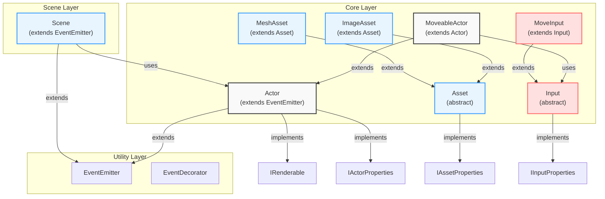
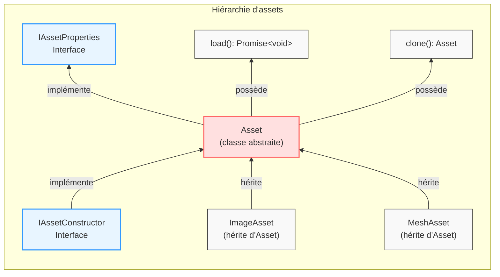
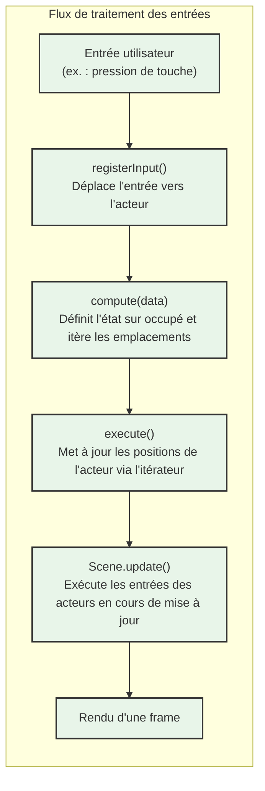
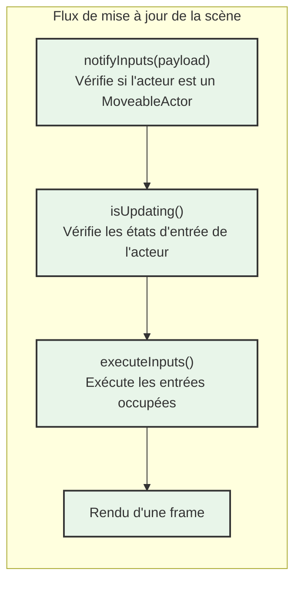

## Folders structure
- core: models, interface, service. All code is agnostic and can be retired and used in other application
- game: data and scene / game instanciation
- application: game adapters

## Architecture

### Class Diagram
The core layer follows a hegagonale architecture with separation between models, utilities, and scene management.

### Asset Hierarchy

### Diagrammes de flux

#### Flux de traitement des entrées

#### Flux de mise à jour de la scène
